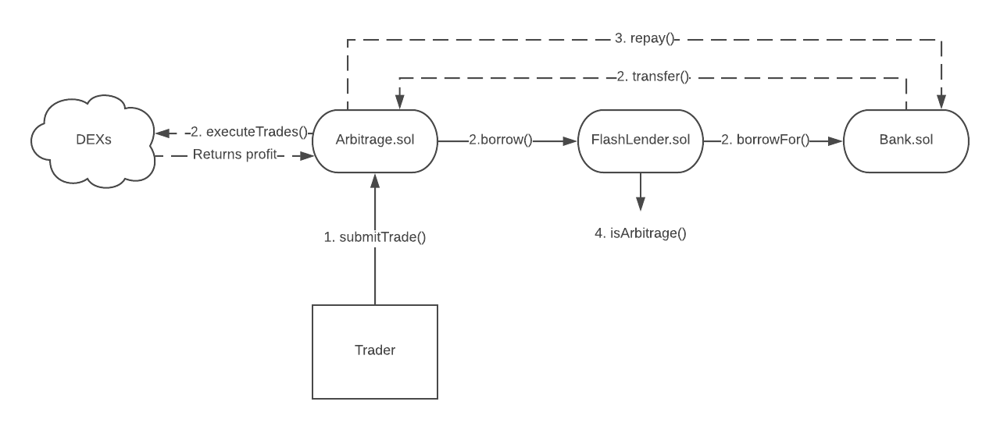

[](https://circleci.com/gh/marbleprotocol/arbitrage)

# ⚡️ Flash Lending

Borrow Ether and ERC20 tokens to take advantage of arbitrage opportunities on Ethereum.

## How it Works

We supply Ether and tokens in a smart contract called [Bank](./contracts/Bank.sol). This contract is currently deployed on the [Ethereum mainnet](https://etherscan.io/address/0xa04e5b78fbd31caec8f8af126d00a57f56c1f7ae) in public beta with a balance of 2 Ether.

[FlashLender](./contracts/FlashLender.sol) is an approved borrower of the bank. It has a method called `borrow` that lets any smart contract do the following in a single transaction:
1. Borrow from the bank
2. [?](https://static.tvtropes.org/pmwiki/pub/images/missing_steps_plan.jpg)
3. Profit
4. Repay the bank

A smart contract can execute any arbitrary code after calling `borrow` by implementing the `executeArbitrage` callback, which will get called by FlashLender. This means anyone can profit from an arbitrage opportunity without using their own capital. The arbitrageur simply pays for the gas cost of the transaction.

At the end of the transaction, Flash Lender enforces that the bank is repaid the entire amount borrowed plus a fee with its `isArbitrage` modifier. The fee is currently set to zero.

## Quick Start: DEX Arbitrage

Flash Lender can be used to execute arbitrage trades on decentralized exchanges.

We deployed [Arbitrage](./contracts/example/Arbitrage.sol), [TradeExecutor](./contracts/example/TradeExecutor.sol), and several exchange wrappers to support this use case.

* `Arbitrage` borrows from FlashLender and sends trade data to TradeExecutor
* `TradeExecutor` executes the trades on the appropriate exchange wrappers
* Exchange wrappers contain all of the logic required to convert Ether to tokens and vice versa on a given decentralized exchange. For example, `ZeroExWrapper` converts Ether to wrapped ETH (WETH) and then uses the 0x exchange contract to swap WETH for another ERC20 token.

We can only support exchanges that allow smart contracts to execute orders. This includes 0x, Bancor, Kyber, and EtherDelta.

If you would like to add an additional exchange integration, please submit a pull request!

If you decide to use this set of smart contracts, this is the basic architecture:



### Make a Trade

1. Find a buy and sell order with an arbitrage profit. Most exchanges have a public API that can be used for this step, like [Radar Relay](https://developers.radarrelay.com/).
2. Encode the buy order on the appropriate exchange wrapper. For example:
```     
zeroExWrapperContract.methods.getTokens(orderAddresses, orderValues, v, r, s).encodeABI();
```
3. Encode the sell order on the appropriate exchange wrapper.
4. Encode the `trade` method on `TradeExecutor` using the encoded buy as `trade1` and the encoded sell as `trade2`.
5. Use the result as the data parameter for `submitTrade` on `Arbitrage`, along with the token to borrow, amount to borrow, and address to send the profits.

We recommend a gas limit of 1 million in order to accomodate exchanges like Bancor that consume a relatively high amount of gas.

See the [arbitrage](./test/arbitrage.js) integration tests for a code example. 


## Testing

In a separate terminal tab, run a local blockchain with [Ganache](https://github.com/trufflesuite/ganache-cli).
```
npm run chain
```

Run the tests.
```
npm run test
```

## Contracts

The smart contracts below were deployed at commit `8df2f0d34feb65eeec34f3760673d9d21ad146aa`.

Bank.sol: [0xa04e5b78fbd31caec8f8af126d00a57f56c1f7ae](https://etherscan.io/address/0xa04e5b78fbd31caec8f8af126d00a57f56c1f7ae)
```
[{"constant":false,"inputs":[{"name":"token","type":"address"},{"name":"amount","type":"uint256"}],"name":"repay","outputs":[],"payable":true,"stateMutability":"payable","type":"function"},{"constant":false,"inputs":[{"name":"token","type":"address"},{"name":"who","type":"address"},{"name":"amount","type":"uint256"}],"name":"borrowFor","outputs":[],"payable":false,"stateMutability":"nonpayable","type":"function"},{"constant":false,"inputs":[{"name":"token","type":"address"},{"name":"amount","type":"uint256"}],"name":"deposit","outputs":[],"payable":true,"stateMutability":"payable","type":"function"},{"constant":false,"inputs":[{"name":"token","type":"address"},{"name":"amount","type":"uint256"}],"name":"borrow","outputs":[],"payable":false,"stateMutability":"nonpayable","type":"function"},{"constant":false,"inputs":[],"name":"renounceOwnership","outputs":[],"payable":false,"stateMutability":"nonpayable","type":"function"},{"constant":false,"inputs":[{"name":"borrower","type":"address"}],"name":"removeBorrower","outputs":[],"payable":false,"stateMutability":"nonpayable","type":"function"},{"constant":true,"inputs":[],"name":"ETH","outputs":[{"name":"","type":"address"}],"payable":false,"stateMutability":"view","type":"function"},{"constant":true,"inputs":[],"name":"owner","outputs":[{"name":"","type":"address"}],"payable":false,"stateMutability":"view","type":"function"},{"constant":true,"inputs":[{"name":"token","type":"address"}],"name":"totalSupplyOf","outputs":[{"name":"balance","type":"uint256"}],"payable":false,"stateMutability":"view","type":"function"},{"constant":true,"inputs":[{"name":"","type":"address"}],"name":"approved","outputs":[{"name":"","type":"bool"}],"payable":false,"stateMutability":"view","type":"function"},{"constant":false,"inputs":[{"name":"borrower","type":"address"}],"name":"addBorrower","outputs":[],"payable":false,"stateMutability":"nonpayable","type":"function"},{"constant":false,"inputs":[{"name":"_newOwner","type":"address"}],"name":"transferOwnership","outputs":[],"payable":false,"stateMutability":"nonpayable","type":"function"},{"constant":false,"inputs":[{"name":"token","type":"address"},{"name":"amount","type":"uint256"}],"name":"withdraw","outputs":[],"payable":false,"stateMutability":"nonpayable","type":"function"},{"anonymous":false,"inputs":[{"indexed":true,"name":"previousOwner","type":"address"}],"name":"OwnershipRenounced","type":"event"},{"anonymous":false,"inputs":[{"indexed":true,"name":"previousOwner","type":"address"},{"indexed":true,"name":"newOwner","type":"address"}],"name":"OwnershipTransferred","type":"event"}]
```

FlashLender.sol: [0x57d586906cb1b995dfce24730906f59d60490ff6](https://etherscan.io/address/0x57d586906cb1b995dfce24730906f59d60490ff6)
```
[{"constant":true,"inputs":[],"name":"version","outputs":[{"name":"","type":"string"}],"payable":false,"stateMutability":"view","type":"function"},{"constant":false,"inputs":[],"name":"renounceOwnership","outputs":[],"payable":false,"stateMutability":"nonpayable","type":"function"},{"constant":true,"inputs":[],"name":"bank","outputs":[{"name":"","type":"address"}],"payable":false,"stateMutability":"view","type":"function"},{"constant":true,"inputs":[],"name":"owner","outputs":[{"name":"","type":"address"}],"payable":false,"stateMutability":"view","type":"function"},{"constant":true,"inputs":[],"name":"fee","outputs":[{"name":"","type":"uint256"}],"payable":false,"stateMutability":"view","type":"function"},{"constant":false,"inputs":[{"name":"_newOwner","type":"address"}],"name":"transferOwnership","outputs":[],"payable":false,"stateMutability":"nonpayable","type":"function"},{"inputs":[{"name":"_bank","type":"address"},{"name":"_fee","type":"uint256"}],"payable":false,"stateMutability":"nonpayable","type":"constructor"},{"anonymous":false,"inputs":[{"indexed":true,"name":"previousOwner","type":"address"}],"name":"OwnershipRenounced","type":"event"},{"anonymous":false,"inputs":[{"indexed":true,"name":"previousOwner","type":"address"},{"indexed":true,"name":"newOwner","type":"address"}],"name":"OwnershipTransferred","type":"event"},{"constant":false,"inputs":[{"name":"token","type":"address"},{"name":"amount","type":"uint256"},{"name":"dest","type":"address"},{"name":"data","type":"bytes"}],"name":"borrow","outputs":[{"name":"","type":"bool"}],"payable":false,"stateMutability":"nonpayable","type":"function"},{"constant":false,"inputs":[{"name":"_bank","type":"address"}],"name":"setBank","outputs":[],"payable":false,"stateMutability":"nonpayable","type":"function"},{"constant":false,"inputs":[{"name":"_fee","type":"uint256"}],"name":"setFee","outputs":[],"payable":false,"stateMutability":"nonpayable","type":"function"}]
```

Arbitrage.sol: [0xea94f0fffaa4f1c17ba190f5df3b738edcd43228](https://etherscan.io/address/0xea94f0fffaa4f1c17ba190f5df3b738edcd43228)
```
[{"constant":true,"inputs":[],"name":"ETH","outputs":[{"name":"","type":"address"}],"payable":false,"stateMutability":"view","type":"function"},{"constant":true,"inputs":[],"name":"tradeExecutor","outputs":[{"name":"","type":"address"}],"payable":false,"stateMutability":"view","type":"function"},{"constant":true,"inputs":[],"name":"lender","outputs":[{"name":"","type":"address"}],"payable":false,"stateMutability":"view","type":"function"},{"constant":true,"inputs":[],"name":"MAX_UINT","outputs":[{"name":"","type":"uint256"}],"payable":false,"stateMutability":"view","type":"function"},{"inputs":[{"name":"_lender","type":"address"},{"name":"_tradeExecutor","type":"address"}],"payable":false,"stateMutability":"nonpayable","type":"constructor"},{"payable":true,"stateMutability":"payable","type":"fallback"},{"constant":false,"inputs":[{"name":"token","type":"address"},{"name":"amount","type":"uint256"},{"name":"dest","type":"address"},{"name":"data","type":"bytes"}],"name":"submitTrade","outputs":[],"payable":false,"stateMutability":"nonpayable","type":"function"},{"constant":false,"inputs":[{"name":"token","type":"address"},{"name":"amount","type":"uint256"},{"name":"dest","type":"address"},{"name":"data","type":"bytes"}],"name":"executeArbitrage","outputs":[{"name":"","type":"bool"}],"payable":false,"stateMutability":"nonpayable","type":"function"},{"constant":true,"inputs":[{"name":"amount","type":"uint256"}],"name":"getRepayAmount","outputs":[{"name":"","type":"uint256"}],"payable":false,"stateMutability":"view","type":"function"}]
```

TradeExecutor.sol: [0x66c16e9524e4143c63fca51a2cbe3cc18944c794](https://etherscan.io/address/0x66c16e9524e4143c63fca51a2cbe3cc18944c794)
```
[{"constant":false,"inputs":[],"name":"withdraw","outputs":[],"payable":false,"stateMutability":"nonpayable","type":"function"},{"constant":false,"inputs":[],"name":"renounceOwnership","outputs":[],"payable":false,"stateMutability":"nonpayable","type":"function"},{"constant":true,"inputs":[],"name":"ETH","outputs":[{"name":"","type":"address"}],"payable":false,"stateMutability":"view","type":"function"},{"constant":false,"inputs":[{"name":"token","type":"address"}],"name":"withdrawToken","outputs":[{"name":"","type":"bool"}],"payable":false,"stateMutability":"nonpayable","type":"function"},{"constant":true,"inputs":[],"name":"owner","outputs":[{"name":"","type":"address"}],"payable":false,"stateMutability":"view","type":"function"},{"constant":false,"inputs":[{"name":"_newOwner","type":"address"}],"name":"transferOwnership","outputs":[],"payable":false,"stateMutability":"nonpayable","type":"function"},{"payable":true,"stateMutability":"payable","type":"fallback"},{"anonymous":false,"inputs":[{"indexed":true,"name":"previousOwner","type":"address"}],"name":"OwnershipRenounced","type":"event"},{"anonymous":false,"inputs":[{"indexed":true,"name":"previousOwner","type":"address"},{"indexed":true,"name":"newOwner","type":"address"}],"name":"OwnershipTransferred","type":"event"},{"constant":false,"inputs":[{"name":"wrappers","type":"address[2]"},{"name":"token","type":"address"},{"name":"trade1","type":"bytes"},{"name":"trade2","type":"bytes"}],"name":"trade","outputs":[],"payable":true,"stateMutability":"payable","type":"function"},{"constant":false,"inputs":[{"name":"wrappers","type":"address[2]"},{"name":"token","type":"address"},{"name":"trade1","type":"bytes"},{"name":"trade2","type":"bytes"}],"name":"tradeForTokens","outputs":[],"payable":false,"stateMutability":"nonpayable","type":"function"}]
```

## Exchange Wrappers

BancorWrapper.sol: [0xd66eba2f90a1dd296736d8b8ac39602200700165 ](https://etherscan.io/address/0xd66eba2f90a1dd296736d8b8ac39602200700165 )
```
[{"anonymous":false,"inputs":[{"indexed":true,"name":"previousOwner","type":"address"},{"indexed":true,"name":"newOwner","type":"address"}],"name":"OwnershipTransferred","type":"event"},{"constant":false,"inputs":[{"name":"converter","type":"address"},{"name":"_path","type":"address[]"},{"name":"_minReturn","type":"uint256"}],"name":"getEther","outputs":[],"payable":false,"stateMutability":"nonpayable","type":"function"},{"anonymous":false,"inputs":[{"indexed":true,"name":"previousOwner","type":"address"}],"name":"OwnershipRenounced","type":"event"},{"constant":false,"inputs":[{"name":"converter","type":"address"},{"name":"_path","type":"address[]"},{"name":"_minReturn","type":"uint256"}],"name":"getTokens","outputs":[],"payable":true,"stateMutability":"payable","type":"function"},{"constant":false,"inputs":[],"name":"renounceOwnership","outputs":[],"payable":false,"stateMutability":"nonpayable","type":"function"},{"constant":false,"inputs":[{"name":"_newOwner","type":"address"}],"name":"transferOwnership","outputs":[],"payable":false,"stateMutability":"nonpayable","type":"function"},{"constant":false,"inputs":[],"name":"withdraw","outputs":[],"payable":false,"stateMutability":"nonpayable","type":"function"},{"payable":true,"stateMutability":"payable","type":"fallback"},{"constant":false,"inputs":[{"name":"token","type":"address"}],"name":"withdrawToken","outputs":[{"name":"","type":"bool"}],"payable":false,"stateMutability":"nonpayable","type":"function"},{"constant":true,"inputs":[],"name":"MAX_UINT","outputs":[{"name":"","type":"uint256"}],"payable":false,"stateMutability":"view","type":"function"},{"constant":true,"inputs":[],"name":"owner","outputs":[{"name":"","type":"address"}],"payable":false,"stateMutability":"view","type":"function"}]
```

ZeroExWrapper.sol: [0x7c5475e3adfe4dab7253ae27727a60a2a3638834](https://etherscan.io/address/0x7c5475e3adfe4dab7253ae27727a60a2a3638834)
```
[{"constant":false,"inputs":[],"name":"withdraw","outputs":[],"payable":false,"stateMutability":"nonpayable","type":"function"},{"constant":true,"inputs":[],"name":"weth","outputs":[{"name":"","type":"address"}],"payable":false,"stateMutability":"view","type":"function"},{"constant":false,"inputs":[],"name":"renounceOwnership","outputs":[],"payable":false,"stateMutability":"nonpayable","type":"function"},{"constant":true,"inputs":[],"name":"ETH","outputs":[{"name":"","type":"address"}],"payable":false,"stateMutability":"view","type":"function"},{"constant":false,"inputs":[{"name":"token","type":"address"}],"name":"withdrawToken","outputs":[{"name":"","type":"bool"}],"payable":false,"stateMutability":"nonpayable","type":"function"},{"constant":true,"inputs":[],"name":"owner","outputs":[{"name":"","type":"address"}],"payable":false,"stateMutability":"view","type":"function"},{"constant":true,"inputs":[],"name":"exchange","outputs":[{"name":"","type":"address"}],"payable":false,"stateMutability":"view","type":"function"},{"constant":true,"inputs":[],"name":"MAX_UINT","outputs":[{"name":"","type":"uint256"}],"payable":false,"stateMutability":"view","type":"function"},{"constant":true,"inputs":[],"name":"proxy","outputs":[{"name":"","type":"address"}],"payable":false,"stateMutability":"view","type":"function"},{"constant":false,"inputs":[{"name":"_newOwner","type":"address"}],"name":"transferOwnership","outputs":[],"payable":false,"stateMutability":"nonpayable","type":"function"},{"inputs":[{"name":"_exchange","type":"address"},{"name":"_weth","type":"address"},{"name":"_proxy","type":"address"}],"payable":false,"stateMutability":"nonpayable","type":"constructor"},{"payable":true,"stateMutability":"payable","type":"fallback"},{"anonymous":false,"inputs":[{"indexed":true,"name":"previousOwner","type":"address"}],"name":"OwnershipRenounced","type":"event"},{"anonymous":false,"inputs":[{"indexed":true,"name":"previousOwner","type":"address"},{"indexed":true,"name":"newOwner","type":"address"}],"name":"OwnershipTransferred","type":"event"},{"constant":false,"inputs":[{"name":"orderAddresses","type":"address[5]"},{"name":"orderValues","type":"uint256[6]"},{"name":"v","type":"uint8"},{"name":"r","type":"bytes32"},{"name":"s","type":"bytes32"}],"name":"getTokens","outputs":[],"payable":true,"stateMutability":"payable","type":"function"},{"constant":false,"inputs":[{"name":"orderAddresses","type":"address[5]"},{"name":"orderValues","type":"uint256[6]"},{"name":"v","type":"uint8"},{"name":"r","type":"bytes32"},{"name":"s","type":"bytes32"}],"name":"getEther","outputs":[],"payable":false,"stateMutability":"nonpayable","type":"function"}]
```

KyberWrapper.sol: [0xf1b94902aa8eeff8b973877e835651b86a3a4a89](https://etherscan.io/address/0xf1b94902aa8eeff8b973877e835651b86a3a4a89)
```
[{"constant":false,"inputs":[],"name":"withdraw","outputs":[],"payable":false,"stateMutability":"nonpayable","type":"function"},{"constant":false,"inputs":[],"name":"renounceOwnership","outputs":[],"payable":false,"stateMutability":"nonpayable","type":"function"},{"constant":false,"inputs":[{"name":"token","type":"address"}],"name":"withdrawToken","outputs":[{"name":"","type":"bool"}],"payable":false,"stateMutability":"nonpayable","type":"function"},{"constant":true,"inputs":[],"name":"owner","outputs":[{"name":"","type":"address"}],"payable":false,"stateMutability":"view","type":"function"},{"constant":true,"inputs":[],"name":"exchange","outputs":[{"name":"","type":"address"}],"payable":false,"stateMutability":"view","type":"function"},{"constant":true,"inputs":[],"name":"MAX_UINT","outputs":[{"name":"","type":"uint256"}],"payable":false,"stateMutability":"view","type":"function"},{"constant":false,"inputs":[{"name":"_newOwner","type":"address"}],"name":"transferOwnership","outputs":[],"payable":false,"stateMutability":"nonpayable","type":"function"},{"inputs":[{"name":"_exchange","type":"address"}],"payable":false,"stateMutability":"nonpayable","type":"constructor"},{"payable":true,"stateMutability":"payable","type":"fallback"},{"anonymous":false,"inputs":[{"indexed":true,"name":"previousOwner","type":"address"}],"name":"OwnershipRenounced","type":"event"},{"anonymous":false,"inputs":[{"indexed":true,"name":"previousOwner","type":"address"},{"indexed":true,"name":"newOwner","type":"address"}],"name":"OwnershipTransferred","type":"event"},{"constant":false,"inputs":[{"name":"dest","type":"address"},{"name":"destAddress","type":"address"},{"name":"maxDestAmount","type":"uint256"},{"name":"minConversionRate","type":"uint256"},{"name":"walletId","type":"address"}],"name":"getTokens","outputs":[],"payable":true,"stateMutability":"payable","type":"function"},{"constant":false,"inputs":[{"name":"src","type":"address"},{"name":"destAddress","type":"address"},{"name":"maxDestAmount","type":"uint256"},{"name":"minConversionRate","type":"uint256"},{"name":"walletId","type":"address"}],"name":"getEther","outputs":[],"payable":false,"stateMutability":"nonpayable","type":"function"}]
```

EtherDeltaWrapper.sol: [0x9183d15070772dfd4524321d000da9b213736d90](https://etherscan.io/address/0x9183d15070772dfd4524321d000da9b213736d90)
```
[{"anonymous":false,"inputs":[{"indexed":true,"name":"previousOwner","type":"address"},{"indexed":true,"name":"newOwner","type":"address"}],"name":"OwnershipTransferred","type":"event"},{"constant":false,"inputs":[{"name":"takerToken","type":"address"},{"name":"takerAmount","type":"uint256"},{"name":"makerAmount","type":"uint256"},{"name":"expires","type":"uint256"},{"name":"nonce","type":"uint256"},{"name":"user","type":"address"},{"name":"v","type":"uint8"},{"name":"r","type":"bytes32"},{"name":"s","type":"bytes32"}],"name":"getEther","outputs":[],"payable":false,"stateMutability":"nonpayable","type":"function"},{"constant":false,"inputs":[{"name":"takerAmount","type":"uint256"},{"name":"makerToken","type":"address"},{"name":"makerAmount","type":"uint256"},{"name":"expires","type":"uint256"},{"name":"nonce","type":"uint256"},{"name":"user","type":"address"},{"name":"v","type":"uint8"},{"name":"r","type":"bytes32"},{"name":"s","type":"bytes32"}],"name":"getTokens","outputs":[],"payable":true,"stateMutability":"payable","type":"function"},{"constant":false,"inputs":[],"name":"renounceOwnership","outputs":[],"payable":false,"stateMutability":"nonpayable","type":"function"},{"constant":false,"inputs":[{"name":"_newOwner","type":"address"}],"name":"transferOwnership","outputs":[],"payable":false,"stateMutability":"nonpayable","type":"function"},{"constant":false,"inputs":[],"name":"withdraw","outputs":[],"payable":false,"stateMutability":"nonpayable","type":"function"},{"anonymous":false,"inputs":[{"indexed":true,"name":"previousOwner","type":"address"}],"name":"OwnershipRenounced","type":"event"},{"payable":true,"stateMutability":"payable","type":"fallback"},{"inputs":[{"name":"_exchange","type":"address"}],"payable":false,"stateMutability":"nonpayable","type":"constructor"},{"constant":false,"inputs":[{"name":"token","type":"address"}],"name":"withdrawToken","outputs":[{"name":"","type":"bool"}],"payable":false,"stateMutability":"nonpayable","type":"function"},{"constant":true,"inputs":[],"name":"ETH","outputs":[{"name":"","type":"address"}],"payable":false,"stateMutability":"view","type":"function"},{"constant":true,"inputs":[],"name":"exchange","outputs":[{"name":"","type":"address"}],"payable":false,"stateMutability":"view","type":"function"},{"constant":true,"inputs":[],"name":"MAX_UINT","outputs":[{"name":"","type":"uint256"}],"payable":false,"stateMutability":"view","type":"function"},{"constant":true,"inputs":[],"name":"owner","outputs":[{"name":"","type":"address"}],"payable":false,"stateMutability":"view","type":"function"}]
```
